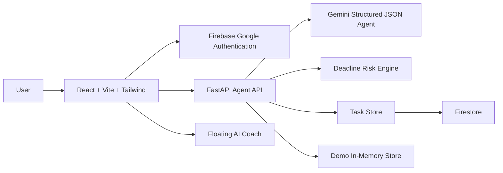

# Architecture

The backend keeps task orchestration, Gemini prompting, risk scoring, analytics, and fallback behavior behind a clean API. The frontend remains a single-page SaaS dashboard with protected routes, AI planning, focus mode, insights, and hackathon story pages.
