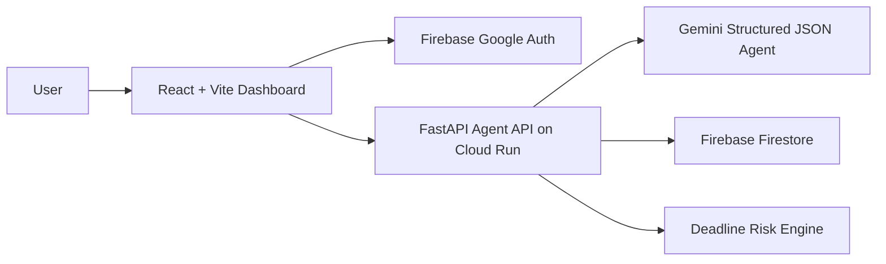
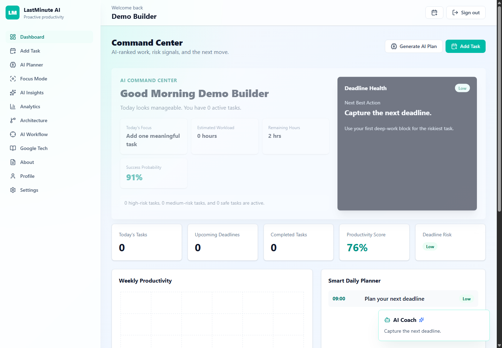

# LastMinute AI


LastMinute AI is an AI-first agentic productivity platform for students, professionals, and entrepreneurs who need help finishing work before deadlines are missed. Instead of passive reminders, it continuously analyzes workload, predicts risk, creates daily schedules, and recommends the next best action.

## Features

- Google sign-in with Firebase Authentication
- User-scoped task management backed by Firestore
- Gemini-powered structured planning for urgency, risk, milestones, schedule, and motivation
- AI Command Center with daily focus, workload, deadline health, and success probability
- Agentic task analysis with priority score, urgency, confidence, start time, finish time, and success probability
- Natural language task creation for messy real-world commitments
- Smart daily planner optimized around risk, effort, and focus capacity
- Floating AI Coach panel with proactive recommendations
- Focus Mode with one-task view, timer, progress, encouragement, and completion action
- AI Insights page with weekly review, burnout detection, strengths, weaknesses, and time waste analysis
- Dashboard with productivity score, risk summary, suggestions, and charts
- AI Planner with timeline, risk meter, recommendation, and execution steps
- Analytics for progress, completion rate, categories, and deadline distribution
- Hackathon story pages for architecture, AI workflow, Google technologies, and project overview
- Responsive SaaS dashboard UI with React, Tailwind CSS, Recharts, Framer Motion, and Lucide Icons
- FastAPI backend with routers, services, schemas, CORS, and Cloud Run-ready Dockerfiles
- Local demo mode when Firebase or Gemini credentials are not configured

## Architecture



## Folder Structure

```text
lastminute-ai/
  frontend/
  backend/
  docs/
  README.md
```

## Installation

### Backend

```bash
cd backend
python -m venv .venv
.venv\Scripts\activate
pip install -r requirements.txt
copy .env.example .env
uvicorn app.main:app --reload
```

### Frontend

```bash
cd frontend
npm install
copy .env.example .env
npm run dev
```

Open `http://localhost:5173`.

The app runs in demo mode without credentials. Add Gemini and Firebase environment variables to enable production integrations.

## Environment Variables

Backend:

- `GEMINI_API_KEY`
- `FIREBASE_PROJECT_ID`
- `FIREBASE_SERVICE_ACCOUNT_JSON`
- `ALLOWED_ORIGINS`

Frontend:

- `VITE_API_URL`
- `VITE_FIREBASE_API_KEY`
- `VITE_FIREBASE_AUTH_DOMAIN`
- `VITE_FIREBASE_PROJECT_ID`
- `VITE_FIREBASE_APP_ID`

## Google Technologies Used

- Gemini API for agentic planning and recommendations
- Firebase Authentication for Google login
- Firebase Firestore for user-specific tasks
- Google Cloud Run for container deployment

## Screenshot



## Cloud Run Deployment

Docker Compose for local container validation:

```bash
docker compose up --build
```

Backend:

```bash
gcloud builds submit backend --tag gcr.io/PROJECT_ID/lastminute-api
gcloud run deploy lastminute-api --image gcr.io/PROJECT_ID/lastminute-api --platform managed --allow-unauthenticated --set-env-vars GEMINI_API_KEY=YOUR_KEY,FIREBASE_PROJECT_ID=PROJECT_ID,ALLOWED_ORIGINS=https://YOUR_FRONTEND_URL
```

Frontend:

```bash
gcloud builds submit frontend --tag gcr.io/PROJECT_ID/lastminute-web
gcloud run deploy lastminute-web --image gcr.io/PROJECT_ID/lastminute-web --platform managed --allow-unauthenticated
```

## Future Scope

- Calendar write-back with Google Calendar
- Voice planning assistant
- Autonomous email or document prep actions
- Habit streaks and accountability workflows
- Push notifications and mobile companion app

## License

MIT
