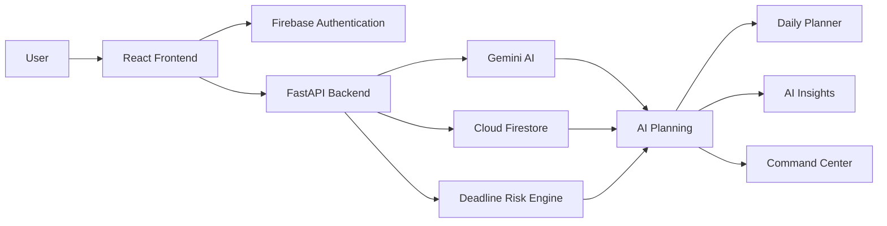

# 🚀 LastMinute AI


An **AI-powered productivity workspace** that helps students, professionals, and entrepreneurs intelligently plan, prioritize, and complete work before deadlines are missed.

Unlike traditional task managers, **LastMinute AI** uses **Google Gemini AI** to analyze workload, predict deadline risks, create optimized schedules, estimate success probability, and recommend the next best action.

---

# 🌐 Live Demo

### 🚀 Try LastMinute AI

**Application:**  
https://ais-pre-a57lamwzaurzcb5dwcvhvz-721778151644.asia-southeast1.run.app/

**GitHub Repository:**  
https://github.com/israfathima/lastminute-ai

---

# 📖 Overview

LastMinute AI is an AI-first, agentic productivity platform built to help users efficiently manage their academic, professional, and personal commitments.

Instead of simply storing tasks, the platform actively understands deadlines, workload, available time, and priorities to generate intelligent execution plans.

Using Google's Gemini AI, the system continuously evaluates task urgency, predicts completion probability, identifies risks, and recommends personalized actions that maximize productivity.

Whether preparing for exams, managing client work, or organizing projects, LastMinute AI serves as an intelligent productivity companion.

---

# ✨ Features

- 🔐 Google Sign-In with Firebase Authentication
- 📋 AI-powered Task Management
- 🤖 Gemini AI Planning Engine
- 📅 Smart Daily Planner
- 🎯 AI Command Center
- ⚠️ Deadline Risk Prediction
- 📈 Success Probability Estimation
- 💡 Personalized Productivity Suggestions
- 📝 Natural Language Task Creation
- 📊 Productivity Dashboard
- 📉 Analytics & Insights
- 🎯 Focus Mode
- ⏱️ Built-in Task Timer
- 🔥 Burnout Detection
- 📚 Weekly Productivity Review
- 📱 Responsive SaaS Dashboard
- ☁️ Google Cloud Run Deployment
- ⚡ Demo Mode without Credentials

---

# 🛠 Tech Stack

| Category | Technologies |
|------------|--------------|
| Frontend | React 19, Vite, Tailwind CSS |
| Backend | FastAPI |
| AI | Google Gemini API |
| Authentication | Firebase Authentication |
| Database | Cloud Firestore |
| Charts | Recharts |
| Icons | Lucide React |
| Animations | Framer Motion |
| Deployment | Google Cloud Run |
| Containerization | Docker |
| Version Control | Git & GitHub |

---

# 🏗 Architecture



---

# ⚙️ AI Workflow

```text
User Input
      │
      ▼
React Dashboard
      │
      ▼
FastAPI Backend
      │
      ├────────► Firebase Authentication
      │
      ├────────► Firestore Database
      │
      └────────► Google Gemini AI
                      │
                      ▼
         Structured Planning Engine
                      │
          ┌───────────┼────────────┐
          ▼           ▼            ▼
     Risk Analysis  Smart Plan  AI Suggestions
          │           │            │
          └───────────┼────────────┘
                      ▼
            Personalized Dashboard
```

---

# 📂 Project Structure

```text
lastminute-ai/

├── frontend/
│   ├── src/
│   ├── components/
│   ├── pages/
│   ├── hooks/
│   ├── services/
│   └── assets/
│
├── backend/
│   ├── app/
│   ├── routers/
│   ├── services/
│   ├── schemas/
│   ├── models/
│   └── utils/
│
├── docs/
│   └── screenshots/
│
├── docker-compose.yml
├── README.md
└── LICENSE
```

---

# 📊 Dashboard Modules

## 🏠 AI Command Center

- Productivity Score
- Daily Focus
- Deadline Health
- Workload Analysis
- Success Probability
- Smart Suggestions

---

## 📅 Smart Planner

- AI Generated Timeline
- Execution Strategy
- Priority Ranking
- Daily Schedule
- Estimated Completion Time

---

## 🤖 AI Coach

- Productivity Recommendations
- Motivation Messages
- Smart Reminders
- Next Best Action

---

## 🎯 Focus Mode

- One Task View
- Countdown Timer
- Progress Tracking
- Completion Action
- Encouragement Messages

---

## 📈 Analytics

- Weekly Productivity
- Task Completion Rate
- Deadline Distribution
- Category Analysis
- Burnout Detection
- Time Waste Analysis

---

# 🚀 Installation

## Clone Repository

```bash
git clone https://github.com/israfathima/lastminute-ai.git

cd lastminute-ai
```

---

## Backend Setup

```bash
cd backend

python -m venv .venv

# Windows

.venv\Scripts\activate

# Linux / macOS

source .venv/bin/activate

pip install -r requirements.txt

copy .env.example .env

uvicorn app.main:app --reload
```

---

## Frontend Setup

```bash
cd frontend

npm install

copy .env.example .env

npm run dev
```

Open:

```
http://localhost:5173
```

---

# 🔑 Environment Variables

## 🔑 Environment Variables

### Backend

Create a `.env` file inside the `backend` folder and add:

```env
GEMINI_API_KEY=your_gemini_api_key
FIREBASE_PROJECT_ID=your_firebase_project_id
FIREBASE_SERVICE_ACCOUNT_JSON=your_firebase_service_account_json
ALLOWED_ORIGINS=http://localhost:5173
```

### Frontend

Create a `.env` file inside the `frontend` folder and add:

```env
VITE_API_URL=http://localhost:8000
VITE_FIREBASE_API_KEY=your_firebase_api_key
VITE_FIREBASE_AUTH_DOMAIN=your-project.firebaseapp.com
VITE_FIREBASE_PROJECT_ID=your_firebase_project_id
VITE_FIREBASE_APP_ID=your_firebase_app_id
```

> **Note:** Never commit your actual API keys, Firebase credentials, or service account files to GitHub. Keep your `.env` files private and add them to `.gitignore`.

# ☁️ Google Technologies Used

- Google Gemini API
- Firebase Authentication
- Cloud Firestore
- Google Cloud Run
- Google Cloud Build

---

# 📸 Screenshots

## Dashboard


---

## AI Planner


---

## Focus Mode


---

## Analytics


---

# 🚀 Cloud Run Deployment

## Local Docker

```bash
docker compose up --build
```

---

## Backend Deployment

```bash
gcloud builds submit backend \
--tag gcr.io/PROJECT_ID/lastminute-api

gcloud run deploy lastminute-api \
--image gcr.io/PROJECT_ID/lastminute-api \
--platform managed \
--allow-unauthenticated \
--set-env-vars GEMINI_API_KEY=YOUR_KEY,FIREBASE_PROJECT_ID=PROJECT_ID,ALLOWED_ORIGINS=https://YOUR_FRONTEND_URL
```

---

## Frontend Deployment

```bash
gcloud builds submit frontend \
--tag gcr.io/PROJECT_ID/lastminute-web

gcloud run deploy lastminute-web \
--image gcr.io/PROJECT_ID/lastminute-web \
--platform managed \
--allow-unauthenticated
```

---

# 💡 Use Cases

- 🎓 Student Assignment Planning
- 📚 Semester Exam Preparation
- 💼 Project Management
- 👨‍💻 Software Development Planning
- 📈 Startup Task Management
- 📅 Personal Productivity
- ⏰ Deadline Tracking
- 🎯 Goal Achievement

---

# 🔮 Future Enhancements

- 📅 Google Calendar Integration
- 📧 Gmail Integration
- 🔔 Push Notifications
- 🎤 Voice Assistant
- 📱 Android & iOS Applications
- 👥 Team Collaboration
- 📊 Advanced Productivity Analytics
- 🤖 Autonomous AI Task Execution

---

# 🎓 Learning Outcomes

This project demonstrates practical knowledge of:

- Agentic AI Applications
- Google Gemini API
- Prompt Engineering
- React Development
- FastAPI
- Firebase Authentication
- Cloud Firestore
- Google Cloud Run
- Docker
- REST API Development
- SaaS Dashboard Design
- AI-powered Productivity Systems

---

# 👩‍💻 Author

**Mohammed Isra Fathima**

B.Tech – Computer Science & Engineering (AI & ML)

🔗 GitHub: https://github.com/israfathima

🌐 Project Repository:

https://github.com/israfathima/lastminute-ai

---

# 🤝 Contributing

Contributions are welcome!

1. Fork this repository
2. Create a feature branch
3. Commit your changes
4. Push the branch
5. Open a Pull Request

---

# ⭐ Support

If you found this project useful, please consider giving it a ⭐ on GitHub.

Your support motivates future improvements and helps others discover the project.

---

# 📜 License

This project is licensed under the **MIT License**.
