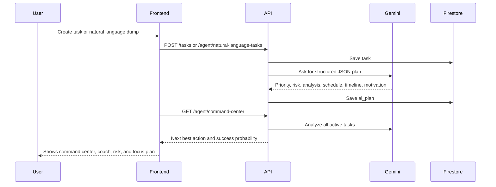

# AI Workflow

```mermaid
sequenceDiagram
  participant User
  participant Frontend
  participant API
  participant Gemini
  participant Firestore

  User->>Frontend: Create task or natural language dump
  Frontend->>API: POST /tasks or /agent/natural-language-tasks
  API->>Firestore: Save task
  API->>Gemini: Ask for structured JSON plan
  Gemini-->>API: Priority, risk, analysis, schedule, timeline, motivation
  API->>Firestore: Save ai_plan
  Frontend->>API: GET /agent/command-center
  API->>Gemini: Analyze all active tasks
  API-->>Frontend: Next best action and success probability
  Frontend-->>User: Shows command center, coach, risk, and focus plan
```

The backend falls back to a deterministic local planner when `GEMINI_API_KEY` is absent, which keeps demos and automated tests usable without cloud credentials.
