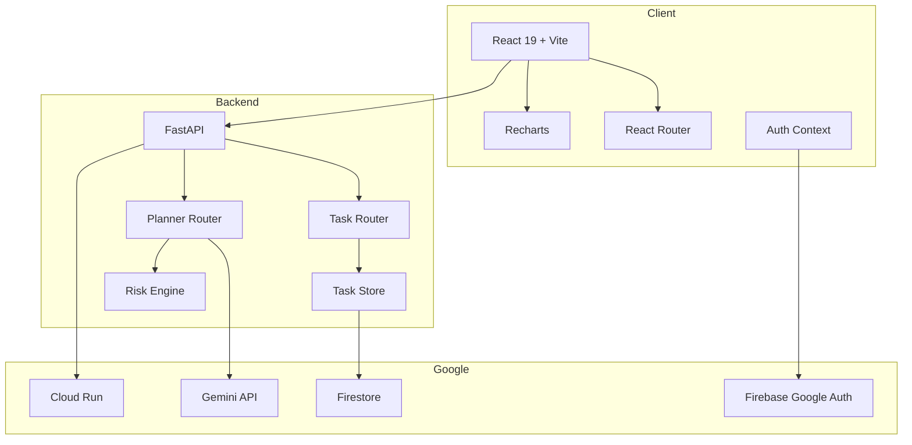

# Architecture

LastMinute AI uses a React SPA for the user experience and a FastAPI service for task orchestration, risk analysis, analytics, and Gemini integration.

```mermaid
flowchart TB
  subgraph Client
    React["React 19 + Vite"]
    Router["React Router"]
    Charts["Recharts"]
    AuthContext["Auth Context"]
  end

  subgraph Google
    FirebaseAuth["Firebase Google Auth"]
    Firestore["Firestore"]
    Gemini["Gemini API"]
    CloudRun["Cloud Run"]
  end

  subgraph Backend
    FastAPI["FastAPI"]
    TaskRouter["Task Router"]
    PlannerRouter["Planner Router"]
    RiskEngine["Risk Engine"]
    Store["Task Store"]
  end

  React --> Router
  React --> Charts
  AuthContext --> FirebaseAuth
  React --> FastAPI
  FastAPI --> TaskRouter
  FastAPI --> PlannerRouter
  PlannerRouter --> Gemini
  PlannerRouter --> RiskEngine
  TaskRouter --> Store
  Store --> Firestore
  FastAPI --> CloudRun
```
