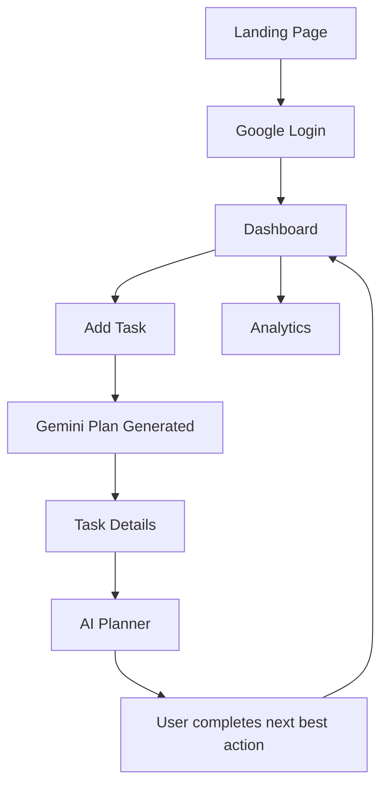

# User Flow

```mermaid
flowchart TD
  Landing["Landing Page"] --> Login["Google Login"]
  Login --> Dashboard["Dashboard"]
  Dashboard --> AddTask["Add Task"]
  AddTask --> Plan["Gemini Plan Generated"]
  Plan --> Details["Task Details"]
  Details --> Planner["AI Planner"]
  Dashboard --> Analytics["Analytics"]
  Planner --> Action["User completes next best action"]
  Action --> Dashboard
```
